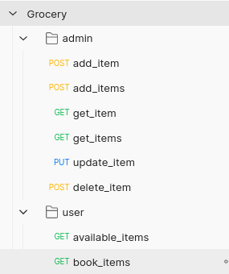

The APIs look something like below and are simple and self-explanatory.


**DATABASE STRUCTURE:**
Below is the basic structure and this can be changed and scaled to cater to real life ecommerce requirements.

For listing item details:
```sql
CREATE TABLE `grocery_items` (
                                 `product_id` varchar(80) NOT NULL COMMENT 'id of the product',
                                 `name` varchar(255) NOT NULL COMMENT 'item name',
                                 `quantity` int NOT NULL COMMENT 'item quantity',
                                 `created_at` timestamp NULL DEFAULT CURRENT_TIMESTAMP COMMENT 'created at of the row item',
                                 `price` double NOT NULL COMMENT 'price of item',
                                 `id` int NOT NULL AUTO_INCREMENT COMMENT 'id of the line item',
                                 PRIMARY KEY (`id`)
) ENGINE=InnoDB AUTO_INCREMENT=5 DEFAULT CHARSET=utf8mb4 COLLATE=utf8mb4_0900_ai_ci COMMENT='holds the list of grocery items'
```
For order item details:
```sql
CREATE TABLE `order_item` (
  `id` int NOT NULL AUTO_INCREMENT,
  `product_id` varchar(80) NOT NULL,
  `product_name` varchar(255) DEFAULT NULL,
  `qty_ordered` int DEFAULT NULL,
  `item_price` double DEFAULT NULL,
  `customer_id` varchar(80) NOT NULL,
  PRIMARY KEY (`id`)
) ENGINE=InnoDB AUTO_INCREMENT=9 DEFAULT CHARSET=utf8mb4 COLLATE=utf8mb4_0900_ai_ci COMMENT='item details of an order'
```

Note - Similarly order table can be made and required data can be stored there.

**Additional Information:**

All the request, response and touch points are logged. 
Also, High-Time alert for queries taking longer time (> 2 secs) is also implemented.


